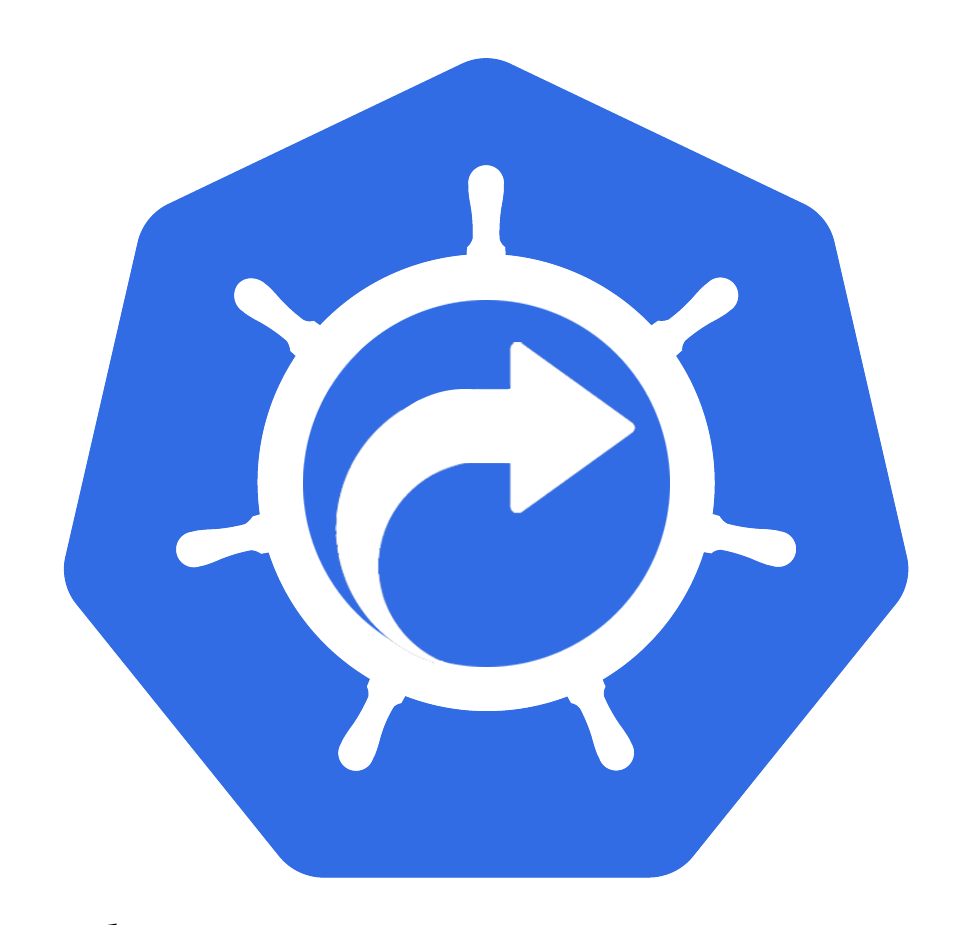

## K8s_SHORTCUTS - A library of Kubernetes Shortcuts

This is a collection of kubectl and bash/zsh shortcuts to make interactions with Kubernetes a bit easier.


[](https://www.codefactor.io/repository/github/bobdotme/k8s_shortcuts)


[](https://gitpod.io/#https://github.com/BobDotMe/k8s_shortcuts)
[](https://cloud.okteto.com/deploy)

k8s_shortcuts integrates into your bash or zsh shell to provide a number of useful shortcuts as well as the ability to keep individual kubectl config files for each cluster.  The makes mangaging the configs much easier to read and manage in the end.

For more details about the solutions currently supported by k8s_shortcuts, please refer to the [project status section](#project-status) below.
We plan to continue adding support for many common functions required based on community demand and engagement in future releases. 

## Getting Started and Documentation

To use the scripts it is *recommended* that you have setup either bash or zsh completion in advance.
Once enabled, you can also enable kubectl's auto completion as well.

To enable these shortcuts you must source them into your shell.  This is dependent on the shell you are using.

You can either download the desired version you would like or if you are lazy like me do something like this if you use bash:

```
source <(kubectl completion bash)
source <(curl -s -L https://github.com/BobDotMe/k8s_shortcuts/releases/latest/download/k8s_shortcuts)gitpod /workspace/k8s_shortcuts
```
Restart your shell and you should be good to go!  Now, review the [documentation](DOCUMENTATION.md) 

## Contributing

We welcome contributions. 

## Report a Bug

For filing bugs, suggesting improvements, or requesting new features, please open an [issue](https://github.com/bobdotme/k8s_shortcuts/issues).

## Contact

Please use the following to reach members of the community:

- Email: [bob@bobdot.me](mailto:bob@bobdot.me)

## Security

### Reporting Security Vulnerabilities

If you find a vulnerability or a potential vulnerability in Rook please let us know immediately at
[bob@bobdot.me](mailto:bob@bobdot.me). We'll send a confirmation email to acknowledge your
report, and we'll send an additional email when we've identified the issues positively or
negatively.


## Project Status

We consider the latest release to be **stable**.  If you use a release candidate proceed with caution. 


### Official Releases

Official releases of k8s_shortcuts can be found on the [releases page](https://github.com/bobdotme/k8s_shortcuts/releases).
Please note that it is **strongly recommended** that you use [official releases](https://github.com/BobDotMe/k8s_shortcuts/releases) of k8s_shortcuts, as unreleased versions from the master branch are subject to changes and incompatibilities that will not be supported in the official releases.
Builds from the master branch can have functionality changed and even removed at any time without compatibility support and without prior notice.

## Licensing

k8s_shortcuts is under the Apache 2.0 [License.](LICENSE)


