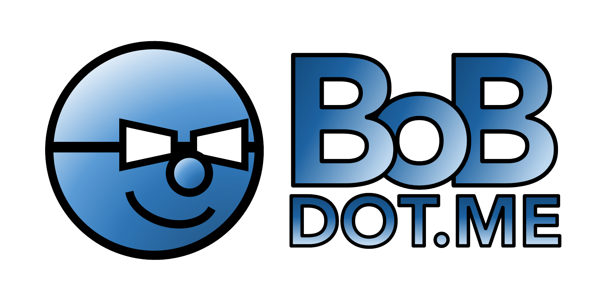

## K8s_SHORTCUTS - A library of Kubernetes Shortcuts

This is a collection of kubectl and bash/zsh shortcuts to make life easier.

k8s_shortcuts turns a simple container instanciation into a power support tool for general troubleshooting, service rendering, and performance evaluation.  It does this by creating a core set services that house and manage the utilities as well as a super lightweight container to invoke in a pod.

k8s_shortcuts integrates deeply into cloud native environments leveraging extension points and providing a seamless experience for scheduling, lifecycle management, resource management, security, monitoring, and user experience.

For more details about the solutions currently supported by k8s_shortcuts, please refer to the [project status section](#project-status) below.
We plan to continue adding support for many common functions required based on community demand and engagement in future releases. See our [roadmap](https://bobdotme.github.io/bob/#!road.md) for more details.

## Getting Started and Documentation

For installation, deployment, and administration, see our [Documentation](https://bobdotme.github.io/bob/#!documentation.md)

## Contributing

We welcome contributions. 

## Report a Bug

For filing bugs, suggesting improvements, or requesting new features, please open an [issue](https://github.com/bobdotme/k8s_shortcuts/issues).

## Contact

Please use the following to reach members of the community:

- Email: [bob@bobdot.me](mailto:bob@bobdot.me)

## Security

### Reporting Security Vulnerabilities

If you find a vulnerability or a potential vulnerability in Rook please let us know immediately at
[bob@bobdot.me](mailto:bob@bobdot.me). We'll send a confirmation email to acknowledge your
report, and we'll send an additional email when we've identified the issues positively or
negatively.

## Project Status

We consider the latest release to be ****stable**.  If you use a release candidate proceed with caution. 

### Official Releases

Official releases of k8s_shortcuts can be found on the [releases page](https://github.com/bobdotme/k8s_shortcuts/releases).
Please note that it is **strongly recommended** that you use [official releases](https://github.com/BobDotMe/k8s_shortcuts/releases) of k8s_shortcuts, as unreleased versions from the master branch are subject to changes and incompatibilities that will not be supported in the official releases.
Builds from the master branch can have functionality changed and even removed at any time without compatibility support and without prior notice.

## Licensing

k8s_shortcuts is under the Apache 2.0 [License.](https://bobdotme.github.io/k8s_shortcuts/LICENSE)

